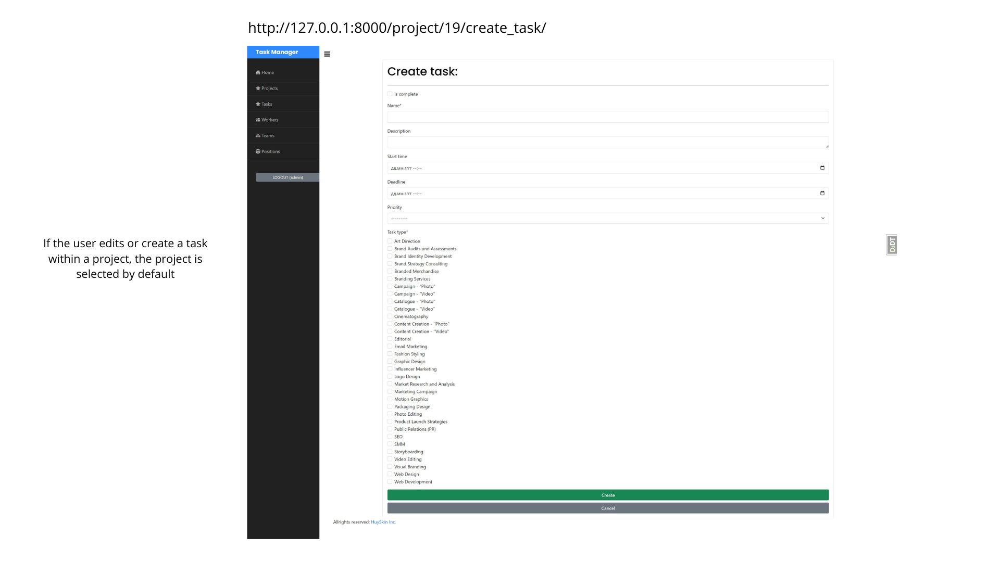
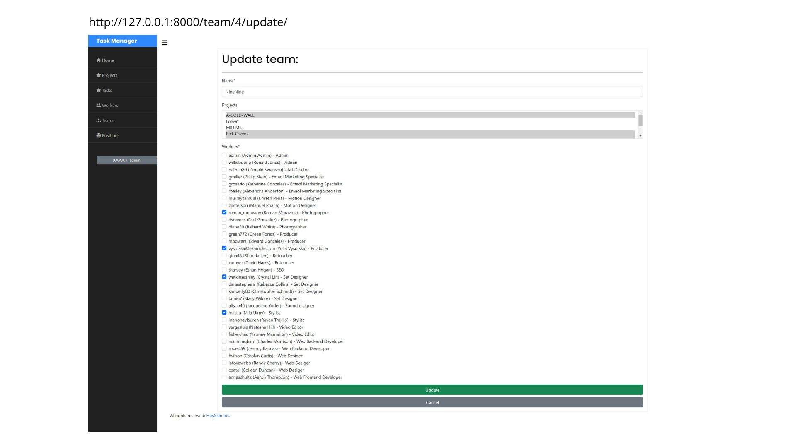
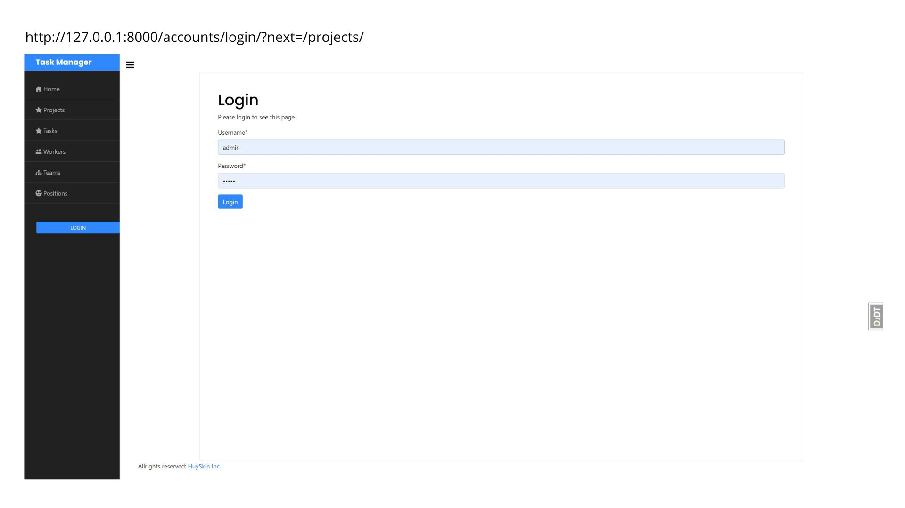

# Project Task Manager

## Overview

This project is a comprehensive task manager tailored for fashion productions,
built using Django. It allows fashion production teams to efficiently organize
and track their projects, tasks, and team members.

## Features

### Projects

- Each project has a name, description, and budget.
- Projects can be marked as complete or incomplete.
- Tasks are associated with specific projects.

### Tasks

- Tasks have a name, description, start time, deadline, and priority level.
- Priority levels include "Urgent," "High," "Medium," and "Low."
- Tasks can be marked as complete or incomplete.

### Task Types

- Task types categorize tasks based on their nature.

### Teams

- Teams consist of workers and can be associated with projects.
- Teams are named and can be linked to multiple projects.

### Workers

- Workers are users with extended profile information, including a position,
  phone number, and country.
- Workers are part of teams and associated with specific projects.

### Positions

- Positions represent roles within the organization and are associated with
  workers.

## Views

### Dashboard

- Provides an overview of project and task statistics.
- Displays the number of workers, teams, positions, and page visits.
- Shows completed and in-progress projects and tasks.

### Projects

- List view displays all projects, highlighting completion status.
- Detail view shows project-specific information, including associated tasks
  and team members.

### Tasks

- Displays a list of all tasks, sorted by start time.
- Detail view provides detailed information about a specific task.

### Workers

- Lists all workers with pagination and a search feature.
- Detail view shows worker-specific information, including associated projects
  and tasks.

### Teams

- Lists all teams, displaying the number of associated projects.
- Detail view shows team-specific information, including associated projects
  and team members.

### Positions

- Lists all positions with pagination and a search feature.

## Usage

### Installation

1. **Clone the Repository:**
   ```bash
   git clone [repository_link]
2. **Navigate to Project Directory:**
    ```bash
   cd path/to/your/directory
3. Open Project in IDE:
   Open the project in your preferred Integrated Development Environment (IDE).
4. **Create and Activate Virtual Environment:**
    ```bash
   python -m venv venv
   source venv/bin/activate
5. **Install Dependencies:**
   ```bash
    pip install -r requirements.txt
6. **Create Superuser:**
    ```bash
    python manage.py createsuperuser
7. **Run Development Server:**
   ```bash
   python manage.py runserver
8. Access the Server:
   Open your web browser and go to http://127.0.0.1:8000/ to check and use the
   server.

### Run the Application

1. Execute `python manage.py runserver` to start the Django development server.
2. Access the application through the provided URL.

### Access Admin Panel

1. Visit `/admin` and log in with the superuser credentials.
2. Use the admin panel to manage projects, tasks, workers, teams, and
   positions.

Feel free to reach out if you have any questions or suggestions!

#### DB-structure diagram


#### Screenshots











